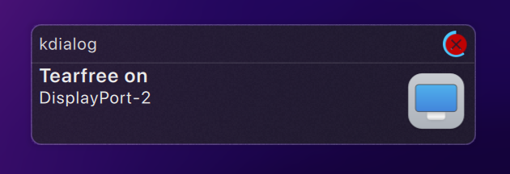

# TearFree Toggle Script for X11

xTearFree allows you to enable or disable the _TearFree_ option in X11, improving the viewing experience by eliminating tearing in some graphical environments.

<!-- <div align="center">  </div> -->

---

## Install

- Download the repository

```sh
git clone https://github.com/gabrielcapilla/xtearfree.git
```

- Run the installation script

```sh
cd ~/xtearfree/tools && bash setup
```

### Uninstall

- Run the script with `--uninstall` flag

```sh
cd ~/xtearfree/tools && bash setup --uninstall
```

---

## How to use

- Enables the TearFree of your system.

```sh
fs on
```

- Disables the TearFree of your system.

```sh
fs off
```

- Display the current status of TearFree using _KDE kdialog popup_.

```sh
fs status
```


- The script is executed silently.

```sh
fs on --silent
fs off --silent
```

### Use it with MPV

Dynamically activate TearFree when running any program. Add the following command to the MPV launcher:

```sh
Exec=fs on --silent; mpv --player-operation-mode=pseudo-gui -- %U ; fs off --silent
```

### Use it with Steam

Avoid tearing without limiting FPS. Add to the launch parameters of your favorite game the following command:

```sh
fs on ; %command% ; fs off
```

---

## About

TearFree controls tearing prevention using the hardware page flipping mechanism. By default, TearFree will be on for rotated outputs, outputs with RandR transforms applied, and for RandR 1.4 slave outputs, and off for everything else. Or you can configure it to be always on or always off with true or false respectively.

```sh
Option "TearFree" "true"
```

You can also enable TearFree temporarily with [xrandr](https://wiki.archlinux.org/title/Xrandr). Check if your device has TearFree and which device is connected.

```sh
xrandr --prop
```

Enter as “output” your device, e.g. _DisplayPort-2_ and set TearFree as _on_.

```sh
xrandr --output DisplayPort-2 --set TearFree on
```

Where output should look like DisplayPort-0 or HDMI-A-0 and can be acquired by running xrandr -q.

[Source: wiki.archlinux.org](https://wiki.archlinux.org/title/AMDGPU)
